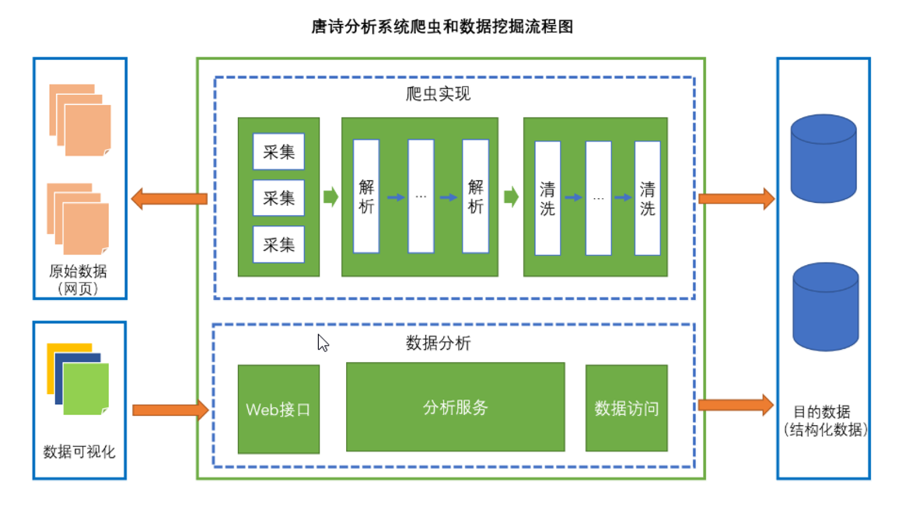

# 唐诗分析器
## 项目描述
唐诗分析器主要是通过爬取古诗文网的唐诗，然后进行数据的清洗，存储，数据分析，数据可视化输出唐诗报告
## 目标数据
数据采集主要来自：[古诗文网](https://www.gushiwen.org/)
## 项目功能
- 数据采集，清洗，存储到数据库  
- 数据分析，统计诗人创作数目，高频词汇，分词  
- 数据可视化输出唐诗分析报告
## 使用技术
- 网页解析工具(htmlunit)
- Stream流式处理
- 多线程
- 数据库和JDBC编程
- 文本分词和解析
- Sparkjava嵌入式Web容器
- 数据可视化(HTML/CSS/JavaScript,echarts,jQuery)

## 实现
唐诗分析程序的框架图

数据分析业务层设计图

## 唐诗分析报告
- 唐诗创作数量排行榜
- 唐诗词云图
##  部署运行 
- 打包 mvn packagDmaven.test.skip=true 输出可执行程序target/tangshi-analyze-1.0.0.jar 
- 配置 application.properties 
- 运行-不启动爬虫 java -jar tangshi-analyze-1.0.0.jar 
- 运行-启动爬虫 java -jar tangshi-analyze-1.0.0.jar crawler-run 
